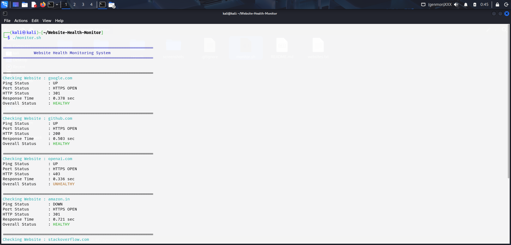
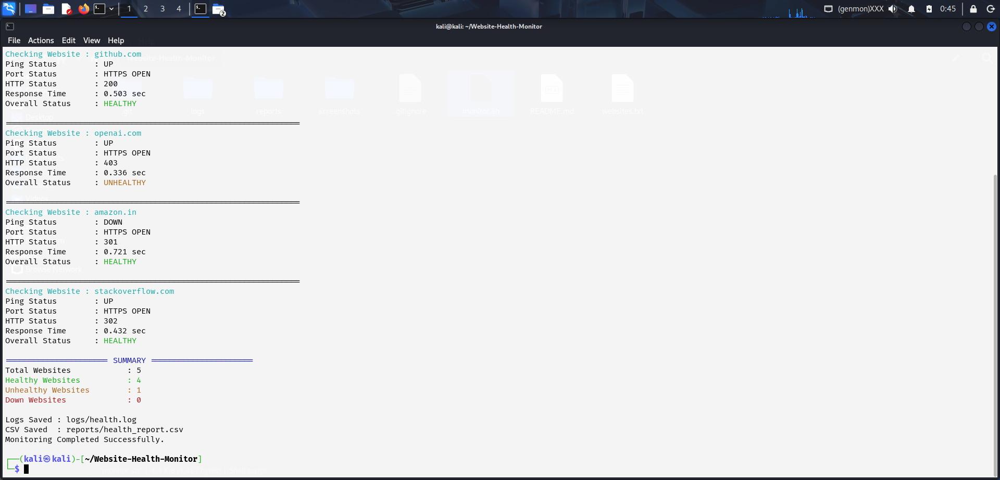
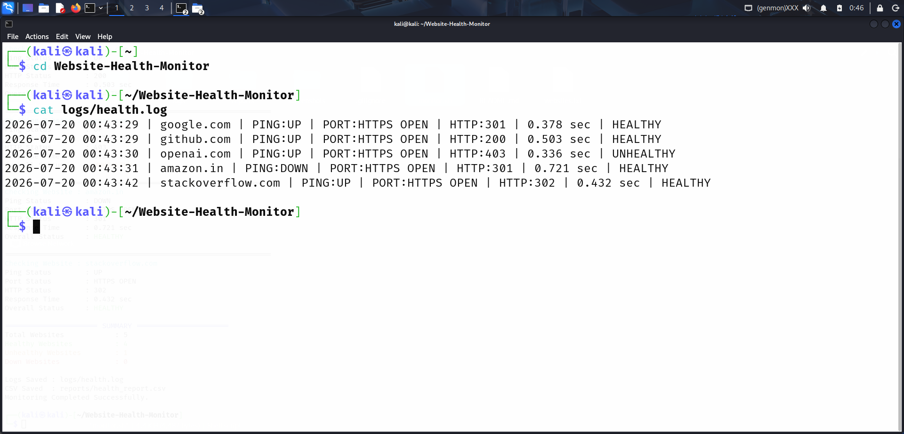
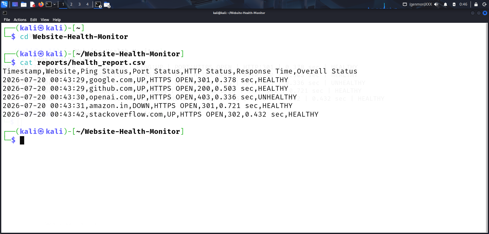
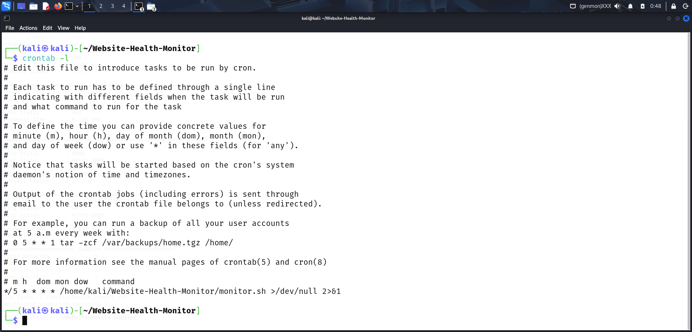

# 🌐 Website Health Monitoring System

A lightweight Linux-based website monitoring tool built using Bash scripting that performs automated health checks for multiple websites. When scheduled with Cron, it can continuously monitor website availability, HTTP response status, response time, and service availability.

The project automatically generates **log files**, **CSV reports**, and supports **Cron automation** for scheduled website health monitoring.

Built as a Linux and Cybersecurity portfolio project to demonstrate Bash scripting, Linux automation, networking fundamentals, and system monitoring concepts.

---

## 🚀 Features

| Feature | Description |
|---------|-------------|
| Website Monitoring | Monitor multiple websites from a single configuration file |
| Ping Check | Verifies network connectivity using ICMP Ping |
| Port Availability | Detects HTTP/HTTPS service availability using Netcat |
| HTTP Status Monitoring | Retrieves HTTP status codes using Curl |
| Response Time | Measures website response time |
| Health Classification | Classifies websites as **HEALTHY**, **UNHEALTHY**, or **DOWN** |
| Log Generation | Stores monitoring history in `logs/health.log` |
| CSV Report | Generates monitoring reports in CSV format |
| Cron Automation | Supports scheduled execution using Cron |
| Colorized Output | Displays readable terminal output with colors |

---

## 🛠️ Technologies Used

| Technology | Purpose |
|------------|---------|
| Bash Shell | Core scripting language |
| Linux (Kali Linux) | Development environment |
| Curl | HTTP request monitoring |
| Ping | Network connectivity testing |
| Netcat (nc) | TCP Port checking |
| Cron | Task scheduling and automation |

---

## 📁 Project Structure

```text
Website-Health-Monitor/
│
├── logs/
│   └── .gitkeep
│
├── reports/
│   └── .gitkeep
│
├── screenshots/
│
├── monitor.sh
├── websites.txt
├── README.md
├── LICENSE
└── .gitignore
```

---

## ⚙️ Local Setup

### 1. Clone the Repository

```bash
git clone https://github.com/ravindravanke/Website-Health-Monitor.git
cd Website-Health-Monitor
```

---

### 2. Install Required Packages

```bash
sudo apt update
sudo apt install curl netcat-openbsd
```

---

### 3. Give Execute Permission

```bash
chmod +x monitor.sh
```

---

### 4. Configure Websites

Edit the `websites.txt` file.

Example:

```text
google.com
github.com
openai.com
amazon.in
stackoverflow.com
```

---

### 5. Run the Script

```bash
./monitor.sh
```

---

## ⏰ Cron Automation

Run the monitoring script automatically every **5 minutes**.

Open Cron Editor:

```bash
crontab -e
```

Add the following line:

```cron
*/5 * * * * /home/<username>/Website-Health-Monitor/monitor.sh >/dev/null 2>&1
```

Replace `<username>` with your Linux username.

Verify the Cron Job:

```bash
crontab -l
```

---

## 📊 Health Status Logic

| Condition | Status |
|-----------|--------|
| HTTP Status = **200 / 301 / 302** | ✅ HEALTHY |
| HTTP Status = **4xx / 5xx** | ⚠️ UNHEALTHY |
| HTTP Status = **000** or Port Closed | ❌ DOWN |

---

## 📊 Sample Output

```text
===============================================================
             Website Health Monitoring System
===============================================================

Checking Website : github.com

Ping Status        : UP
Port Status        : HTTPS OPEN
HTTP Status        : 200
Response Time      : 0.529 sec
Overall Status     : HEALTHY

===============================================================
```

---

## 📄 Generated Reports

### Health Log

```
logs/health.log
```

Stores:

- Timestamp
- Website
- Ping Status
- Port Status
- HTTP Status
- Response Time
- Overall Status

---

### CSV Report

```
reports/health_report.csv
```

CSV Format:

| Timestamp | Website | Ping | Port | HTTP | Response Time | Status |
|-----------|----------|------|------|------|---------------|--------|

The generated CSV can be opened using Microsoft Excel, LibreOffice Calc, or Google Sheets for further analysis.

---

## 📸 Screenshots

### Terminal Output (Part 1)



---

### Terminal Output (Part 2)



---

### Health Log



---

### CSV Report



---

### Cron Automation



---

## 🚀 Future Enhancements

- Email Notifications
- Telegram Alerts
- Slack Integration
- Discord Notifications
- HTML Dashboard
- Database Logging
- Website Uptime Statistics
- Graph Generation
- Multi-threaded Website Monitoring

---

## 📜 License

This project is licensed under the **MIT License**.

See the `LICENSE` file for more information.

---

## 👨‍💻 Author

**Ravindra**

Cybersecurity Enthusiast | SOC Analyst (L1) | Linux | Bash Scripting | Networking

- GitHub: https://github.com/ravindravanke
- LinkedIn: https://linkedin.com/in/ravindra2901

---

## ⭐ Support

If you found this project useful:

- ⭐ Star this repository
- 🍴 Fork the repository
- 🛠️ Feel free to contribute
- 🐞 Report issues or suggest improvements

Thank you for visiting this project!
